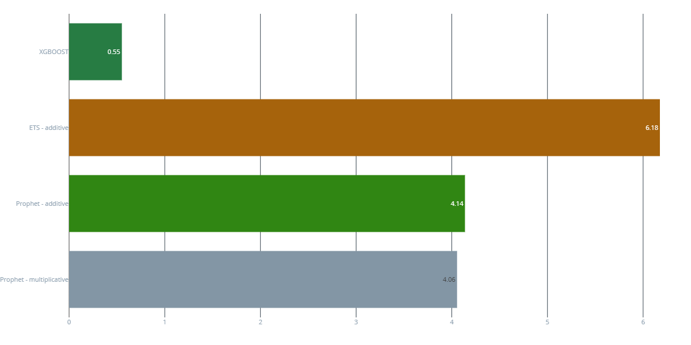

# DsrpTrabajoFinalMLE2

<a target="_blank" href="https://cookiecutter-data-science.drivendata.org/">
    
</a>

Este es el trabajo final del modulo MLE2 del programa de epecializado en Machine Learning Engineer

## Project Organization

```
├── LICENSE            <- Open-source license if one is chosen
├── Makefile           <- Makefile with convenience commands like `make data` or `make train`
├── README.md          <- The top-level README for developers using this project.
├── data
│   ├── external       <- Data from third party sources.
│   ├── interim        <- Intermediate data that has been transformed.
│   ├── processed      <- The final, canonical data sets for modeling.
│   └── raw            <- The original, immutable data dump.
│
├── docs               <- A default mkdocs project; see www.mkdocs.org for details
│
├── models             <- Trained and serialized models, model predictions, or model summaries
│
├── notebooks          <- Jupyter notebooks. Naming convention is a number (for ordering),
│                         the creator's initials, and a short `-` delimited description, e.g.
│                         `1.0-jqp-initial-data-exploration`.
│
├── pyproject.toml     <- Project configuration file with package metadata for 
│                         packageDsrpMLE2 and configuration for tools like black
│
├── references         <- Data dictionaries, manuals, and all other explanatory materials.
│
├── reports            <- Generated analysis as HTML, PDF, LaTeX, etc.
│   └── figures        <- Generated graphics and figures to be used in reporting
│
├── requirements.txt   <- The requirements file for reproducing the analysis environment, e.g.
│                         generated with `pip freeze > requirements.txt`
│
├── setup.cfg          <- Configuration file for flake8
│
└── packageDsrpMLE2   <- Source code for use in this project.
    │
    ├── __init__.py             <- Makes packageDsrpMLE2 a Python module
    │
    ├── config.py               <- Store useful variables and configuration
    │
    ├── dataset.py              <- Scripts to download or generate data
    │
    ├── features.py             <- Code to create features for modeling
    │
    ├── modeling                
    │   ├── __init__.py 
    │   ├── predict.py          <- Code to run model inference with trained models          
    │   └── train.py            <- Code to train models
    │
    └── plots.py                <- Code to create visualizations
```

--------

##  Problema de ML
Se busca predecir el consumo energetico de la empresa PJM Interconnection LLC. Empresa de energis de USA.

## Diagrama de flujo del proyecto


## Diccionario de datos

|  cabecera      |tipo         | descripcion |
|----------------|-------------|-------------|
|**Datetime**  |timestamp      |marca de tiempo con una granularidad de 1h|
|**PJME_MW**  |float      |consumo energetico en Megawatts (MW)|

# Model Card

## Metadata

- **Library**: scikit-learn, feast, prophet, statsmodels, xgboost, ExponentialSmoothing
- **Tags**: # Serie Temporal

## Authors

- José Adolfo Cusihuallpa

## Framework

scikit-learn, JupiterLab, Feast

## Intended Uses

El trabajo pretende hacer la prediccion del consumo electrico de la empresa PJM.

## Model Description

Se entrenan los modelos Prophet, ExponentialSmoothing (ETS) y XGBRegressor

## Visualización del dataset


## Resultados
Comparacion de la metrica RMSE de los modelos.




## Conclusiones

De los resultados de ambos modelos se ve que el Modelo Trabajado con Regresor Logistico presenta mejores resultados que al que se entreno con PCA+KMeans. Esto no nesesariamente indica que no se pueda aplicar PCA+KMeans al dataset de este trabajo, el mal resultado del segundo modelo puede ser por que no se aplicaron mas etapas previas de preprocesamiento de la data asi tambien como elegir otros valoroes de los hiperparametros.
